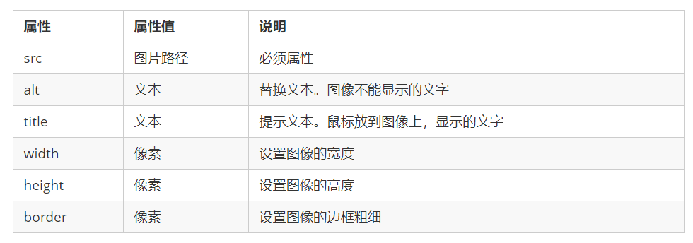

# HTML—语法规范

---

---

## 标签形式

### 双标签

>HTML 标签通常是成对出现的。
>
>第一个标签是开始标签，第二个标签是结束标签。

### 单标签

>常见的单标签包括：
>
>~~~html
> 
>

>
><input>
><param>
><meta>
><link>
>~~~

---

## 标签关系

### 包含关系

~~~html
<head> 
    <title> </title> 
</head>
~~~

### 并列关系

~~~html
<head> </head>
<body> </body>
~~~

---

---

---

# HTML—结构标签

---

---

~~~html
<!DOCTYPE html>

<html lang="en">

    <head>
        <meta charset="UTF-8">
        <meta http-equiv="X-UA-Compatible" content="IE=edge">
        <meta name="viewport" content="width=device-width, initial-scale=1.0">
        <title>Document</title>
    </head>

    <body>
    </body>

</html>
~~~

---

## HTML 基本结构标签

### **`<html></html>`**

### **`<head></head>`**

### **`<title></title>`**

### **`<body></body>`**

---

## HTML 其他结构标签

### **`<!DOCTYPE> 标签`**

><!DOCTYPE>是`文档类型声明标签`，不是一个 HTML 标签。
>
> <!DOCTYPE> 声明位于文档中的最前面的位置，处于 <html> 标签之前
>
>~~~html
><!DOCTYPE html>
>~~~
>
>这句代码的意思是: 当前页面采取的是 HTML5 版本来显示网页。

### **`lang 语言`**

>用来定义当前文档显示的语言
>
>+   `en`定义语言为`英语`
>+   `zh-CN`定义语言为`中文`
>
>其实对于文档显示来说，定义成en的文档也可以显示中文，定义成zh-CN的文档也可以显示英文，但是可以起到标识作用

### **`<meta> 标签`**

[HTML中的meta标签详解](https://www.jianshu.com/p/179ddc16ef55)：https://www.jianshu.com/p/179ddc16ef55

#### name属性

##### 定义

>`name`属性主要用于描述网页，与之对应的属性值为`content`，`content`中的内容主要是便于搜索引擎机器人查找信息和分类信息用的。

##### 语法

~~~html
<meta name="参数" content="参数变量值" >
~~~

##### 常见写法

~~~html
■ 在移动设备浏览器上，禁用缩放（zooming）功能，用户只能滚动屏幕
<meta name="viewport" content="width=device-width, initial-scale=1, maximum-scale=1, user-scalable=no">

■ 告诉搜索引擎，当前页面的主要内容是xxx 
<meta name="description" content="">

■ 告诉搜索引擎，当前页面的关键字
<meta name="keywords" content="网页,网页制作,网页特效,建站指南,教程下载,动画制作" >

■ 告诉搜索引擎，标注网站作者是谁
<meta name="author" content="" >

■ 标注网站的版权信息
<meta name="copyright" content="" >
~~~

#### http-equiv属性

##### 定义

>`http-equiv`顾名思义，相当于`http`的文件头作用，它可以向浏览器传回一些有用的信息，以帮助正确和精确地显示网页内容，与之对应的属性值为`content`，`content`中的内容其实就是各个参数的变量值。

##### 语法

~~~html
<meta http-equiv="参数" content="参数变量值" >
~~~

##### 常用写法

~~~html
■  如果网页过期，那么存盘的cookie将被删除。必须使用GMT的时间格式
<meta http-equiv="Set-Cookie" content="cookievalue=xxx; expires=Friday,12-Jan-2001 18:18:18 GMT; path=/" >

■ 用于设定网页的到期时间。一旦网页过期，必须到服务器上重新传输。
<meta http-equiv="expires" content="时间" >

■ 告诉浏览器在【数字】秒后跳转到【一个网址】
<meta http-equiv="Refresh" content="5;URL" >

■ 设定页面使用的字符集
<meta http-equiv="content-Type" content="text/html; charset=utf-8" >

■ 在HTML5中设定字符集的简写写法
  <meta charset="utf-8">

■ 禁止浏览器从本地计算机的缓存中访问页面内容，访问者将无法脱机浏览
<meta http-equiv="Pragma" content="no-cache" >

■ 用来防止别人在iframe(框架)里调用自己的页面，这也算是一个非常实用的属性
<meta http-equiv="Window-target" content="_top" >

■ 强制浏览器按照特定的版本标准进行渲染。但不支持IE7及以下版本。如果是ie浏览器就用最新的ie渲染，如果是双核浏览器就用chrome内核。
<meta http-equiv="X-UA-Compatible" content="IE=edge,chrome=1">
~~~

---

---

---

# HTML—常用标签

---

---

## 标题标签	`<h1>-<h6>`

### 标签语义

>   作为标题使用，并且依据重要性递减。

### 特点

>+    加了标题的文字会变的加粗，字号也会依次变大。
>+   一个标题独占一行。

### 等级	

>   `<h1> - <h6>` 六个等级

---

## 段落标签	`
`

### 标签语义

>   可以把 HTML 文档分割为若干段落。

### 语法

~~~html

 我是一个段落标签 

~~~

### 特点	

>   +   文本在一个段落中会根据浏览器窗口的大小自动换行。
>   +   段落和段落之间保有`空隙`。

---

## 换行标签	` `

### 标签语义

>   强制换行

### 特点

>   +   ` ` 是个`单标签`。
>   +   ` `标签只是简单地开始新的一行，跟段落不一样，段落之间会插入一些垂直的间距。

---

## 文本格式化标签

### 加粗  `<strong> 或 <b>` 

### 倾斜  `<em> 或 <i>`   

### 删除线  `<del> 或 <s>` 

### 下划线  `<ins> 或 <u>` 

---

## "图层" 标签 `
 或 ` 

### 标签语义

>   `
` 和 `` 没有语义，它们就是一个盒子，用来装内容的

### 语法

~~~html

 这是头部 
 
 今日价格 
~~~

### 特点

>   大盒子：`
` 标签用来布局，但是现在一行只能放一个`
` 
>
>   小盒子：`` 标签用来布局，一行上可以多个 `` 

---

## 图像标签

### 标签语义

>   定义 HTML 页面中的图像

### 语法（单标签）

~~~html

~~~

### 标签属性

>`图像标签属性注意点`:
>
>
>① 图像标签可以拥有`多个属性`，必须写在标签名的后面。 
>
>② 属性之间`不分先后顺序`，标签名与属性、属性与属性之间均以空格分开。 
>
>③ 属性采取`键值对`的格式，即 key=“value" 的格式，属性 =“属性值”。

---

## 超链接标签

### 标签语义

>   用于定义超链接，作用是从一个页面链接到另一个页面

### 语法

~~~html
<a href="跳转目标" target="目标窗口的弹出方式"> 文本或图像 </a>
~~~

### 标签属性

>   `href`:
>
>   +   指定跳转的链接目标url地址
>
>   `target`: 
>
>   +   指定链接页面的打开方式：
>
>       ① `_self`(默认会覆盖原来的窗口)   
>
>       ②`_blank`(会以新的窗口打开)

### 链接分类

#### 外部链接

>   例如: `<a href="http:// www.baidu.com "> 百度</a >`

#### 内部链接

>   网站内部页面之间的相互链接. 直接链接内部页面名称即可
>
>   例如: `<a href="index.html"> 首页 </a >`

#### 空链接

>    如果当时没有确定链接目标时, `<a href="#"> 首页 </a >`		

#### 下载链接

>   如果 href 里面地址是一个文件或者压缩包，会下载这个文件

#### 网页元素链接

>   在网页中的各种网页元素，如文本、图像、表格、音频、视频等都可以添加超链接

#### 锚点链接

>   点我们点击链接,可以快速定位到页面中的某个位置

写法：

>   ① 在链接文本的 href 属性中，设置属性值为 `#名字` 的形式
>
>   如:  `<a href="#two"><a href="#two"> 第2集 </a>`
>
>   ② 找到目标位置标签，里面添加一个 `id 属性 = 刚才的名字` 
>
>   如：`<h3 id="two">第2集介绍</h3>` 

---

---

---

#  HTML—注释和特殊字符

---

---

## 注释

### 语法

~~~html
<!-- 注释语句 -->
~~~

### 快捷键

>    ctrl + /

---

## 特殊字符

---

---

---

# HTML—表格标签

---

---

## 表格基本语法

~~~html
<table>
    <caption>表格标题</caption>
    <tr>
         <th>表头文字</th>
        <td>单元格内的文字</td>
    </tr>
</table>
~~~

---

## 标签类型

---

### 基本主体标签

#### `<table></table>` 表格

>   是用于定义表格的标签

`<caption></caption>`  表格的标题 

>   写在内部 、显示外部 、居中

#### `<tr></tr>` 行

>   用于定义表格中的行，必须嵌套在 `<table></table>`标签中

#### `<th></th>` 表头 

>   表示 HTML 表格的`表头部分`(table head）
>
>   加粗 、加黑、自动居中

#### `<td></td>` 单元格	

>   用于定义表格中的`单元格`，必须嵌套在`<tr></tr>`标签中

---

### 结构标签

#### `<thead></thead>`  结构头

>   用于定义表格的头部。`<thead>` 内部必须拥有 `<tr>` 标签。
>
>    一般位于第一行。

#### `<tbody></tbody>`  结构体

>   用于定义表格的主体，主要用于放数据本体 。

#### `<tfoot></tfoot>` 结构底

---

## 表格属性

### border

>   表格的边框   默认为0

### width

>   宽度

### height

>   高度

### cellspacing

>   单元格与单元格之间的距离

### cellspadding

>   单元格与内容之间的距离

### align: left/center/right ( 对齐方式 )

>   `注意`：
>
>   +   当给表格设置居中时，整个表格会在页面中居中（文字不会居中）    
>   +   当指定 tr 或者 td  设置居中时，里面的文字会在表格栏里居中

### colspan / rowspan  ( 合并单元格 )

>   `colspan`:  列合并    
>
>   `rowspan`：行合并 

---

## 合并单元格

### 合并单元格方式

>`跨行合并`：rowspan="合并单元格的个数" 
>
>`跨列合并`：colspan="合并单元格的个数"

### 合并单元格步骤

>   +   先确定是跨行还是跨列合并
>   +   找到目标单元格，写上【`合并方式` = `合并的单元格数量`】
>   +   删除多余的单元格

---

---

---

# HTML—列表标签

---

---

## 无序列表

### 定义

>   `<ul>` 标签表示 HTML 页面中项目的无序列表，一般会以项目符号呈现列表项，而列表项使用 `<li>` 标签定义

#### 语法

~~~html
<ul>
    <li>列表项1</li>
    <li>列表项2</li>
    <li>列表项3</li>
</ul>
~~~

#### 特点

>   +   无序列表的各个列表项之间`没有顺序级别`之分，是并列的。
>   +   `<ul></ul>` 中只能嵌套 `<li></li>`，直接在 `<ul></ul>` 标签中输入其他标签或者文字的做法是不被允许的。
>   +   `<li>` 与 `</li>` 之间相当于一个`容器`，可以容纳所有元素。
>   +   无序列表会带有`自己的样式属性`，但在实际使用时，会使用 CSS 来设置。

---

## 有序列表

### 定义

>   `<ol>` 标签用于定义有序列表，列表排序以数字来显示，并且使用 `<li>` 标签来定义列表项

#### 语法

~~~html
<ol>
    <li>列表项1</li>
    <li>列表项2</li>
    <li>列表项3</li>
</ol>
~~~

#### 特点

>   +   `<ol></ol>`中只能嵌套`<li></li>`，直接在`<ol></ol>`标签中输入其他标签或者文字的做法是不被允许的。
>   +   `<li>` 与 `</li>`之间相当于一个`容器`，可以容纳所有元素。
>   +   有序列表会带有`自己的样式属性`，但在实际使用时，会使用 CSS 来设置。

---

## 自定义列表

### 定义

>   `<dl>` 标签用于定义描述列表（或定义列表），该标签会与 `<dt>`（定义项目/名字）和 `<dd>`（描述每一个项目/名字）一起使用。

#### 语法

~~~html
<dl>
    <dt>名词1</dt>
    <dd>名词1解释1</dd>
    <dd>名词1解释2</dd>
</dl>
~~~

#### 特点

>   `<dl></dl>` 里面只能包含 `<dt>` 和 `<dd>`。
>
>   `<dt>` 和 `<dd>`个数没有限制，经常是一个`<dt>` 对应多个`<dd>`。

---

---

---

# HTML—表单标签

---

---

## 表单功能

>   使用表单目的是为了`收集用户信息`

---

---

## 表单组成

### Ⅰ— 表单域

#### 作用

>`<form>` 会把它范围内的表单元素信息提交给服务器

#### 语法

~~~html
<form action="url地址" method="提交方式"  name="表单域名称">
    各种表单元素控件
</form>
~~~

#### 常用属性

---

---

### Ⅱ — 表单控件/表单控件

#### **input输入表单元素**

##### 语法（单标签）

~~~html
<input type="属性值" />
~~~

##### input的属性

+   **`type属性`**

>   type 属性设置不同的属性值用来指定不同的控件类型
>
>   
>
>   **`【type属性的属性值】：`**
>
>   +   `text`：文本框
>   +   `password`：密码框
>   +   `radio`：单选按钮   （如果是一组，必须给他们命名相同的名字）
>   +   `checkbox`：复选框 （如果是一组，必须给他们命名相同的名字）
>   +   `button`：普通按钮
>   +   `reset`：重置按钮  ( 需要配合form表单才有作用 )
>   +   `submit`：提交按钮
>   +   `image`：属性  src
>   +   `file` 文件按钮：上传图片

+   `name属性`

>   name定义input元素的名称
>
>   name 的主要作用就是用于`区别不同的表单元素`

+   `value属性`

>   规定input元素的名称
>
>   常用于设置元素内的默认显示文字

+   `checked属性`

>   主要针对于单选按钮和复选框, 主要作用一打开页面,就要可以默认选中某个表单元素。

+   `maxlength属性`

>   在表单元素输入的最大字符数

注意事项：

>   -   `name` 和`value` 是每个表单元素都有的属性值 (主要给后台人员使用)
>   -   name 表单元素的名字, 要求 `单选按钮 和 复选框 要有相同的 name 值`
>   -   name的标识，对于单选按钮 ，只能选择一个

##### `<label>` 标签

+   作用

>   为 input 元素定义标注（标签）
>
>   标签用于绑定一个表单元素, 当点击`<label>` 标签内的文本时，浏览器就会自动将焦点(光标)转到或者选择对应的表单元素上,用来增加用户体验

+   语法

~~~html
<label for="sex">男</label>
<input type="radio" name="sex" id="sex" />
~~~

>核心： 
>
>【`<label> 标签的 for 属性` 】 与 【`相关元素的 id 属性`】 相同

---

#### **select下拉表单元素**

##### 使用场景

>   如果有多个选项让用户选择，且想要节约页面空间时，可以使用`<select>` 标签控件定义下拉列表

##### 语法

~~~html
<select>
    <option>选项1</option>
    <option>选项2</option>
    <option>选项3</option>
</select>
~~~

##### 注意事项

>`<select>` 中至少包含一对`<option>` 
>
> 在`<option>` 中定义 selected ="selected" 时，当前项即为`默认选中项`

##### select的属性

---

#### **textarea 文本域元素**

##### 使用场景

>   当用户输入内容较多的情况时，不能使用文本框表单了，可以使用 `<textarea>` 标签

##### 语法

~~~html
<textarea rows="3" cols="20">
    文本内容
</textarea>
~~~

>   cols=“每行中的字符数” ，rows=“显示的行数”
>
>   但在实际开发中不会使用，都是用 `CSS 来改变大小`。

---

---

### Ⅲ — 提示信息

>表单控件元素等的说明文字

# 其他

---

---

## 路径

### 目录文件夹和根目录

>   `目录文件夹`：就是普通文件夹，里面只不过存放了我们做页面所需要的相关素材，比如 html 文件、图片等。
>
>   `根目录`：打开目录文件夹的第一层就是根目录.

### 相对路径

>   `相对路径`：以引用文件所在位置为参考基础，而建立出的目录路径。
>
>   相对路径是从代码所在的这个文件出发，去寻找目标文件的。

### 绝对路径

>   `绝对路径`：是指目录下的绝对位置，直接到达目标位置，通常是从盘符开始的路径。
>
>   `类型`：
>
>   +   盘符开始的路径：“D:\web\img\logo.gif”	
>   +   完整的网络地址：“http://www.itcast.cn/images/logo.gif”

